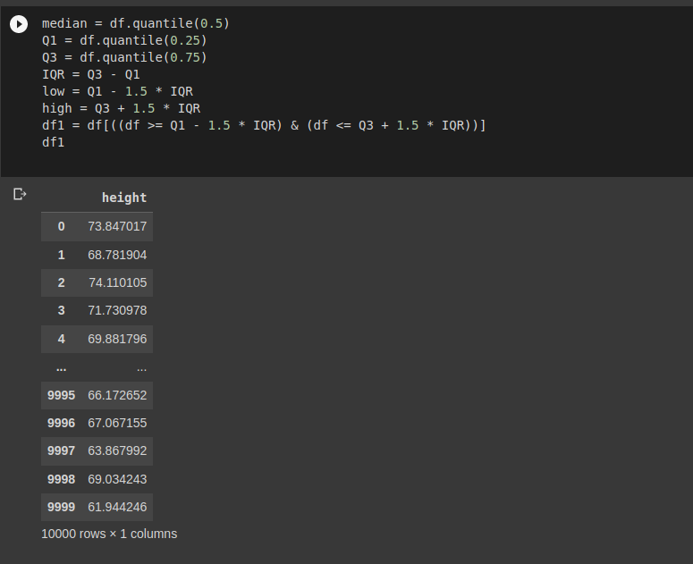

# Ex02-Outlier

You are given bhp.csv which contains property prices in the city of banglore, India. You need to examine price_per_sqft column and do following,

(1) Remove outliers using IQR 

(2) After removing outliers in step 1, you get a new dataframe.

(3) use zscore of 3 to remove outliers. This is quite similar to IQR and you will get exact same result

(4) for the data set height_weight.csv find the following

    (i) Using IQR detect weight outliers and print them

    (ii) Using IQR, detect height outliers and print them

# CODE
## bhp.csv
```
import numpy as np
import pandas as pd
from scipy import stats
a = pd.read_csv('bhp.csv')
df = pd.DataFrame(a['price_per_sqft'])
median = df.quantile(0.5)
Q1 = df.quantile(0.25)
Q3 = df.quantile(0.75)
IQR = Q3 - Q1
low = Q1 - 1.5 * IQR
high = Q3 + 1.5 * IQR
df1 = df[((df >= Q1 - 1.5 * IQR) & (df <= Q3 + 1.5 * IQR))]
print(df1)
z = np.abs(stats.zscore(df))
df1 = df1[(z < 3)]
print(df1)
```
## height_weight.csv
```
import numpy as np
import pandas as pd
from scipy import stats
a = pd.read_csv('height_weight.csv')
df = pd.DataFrame(a['height'])
print(df)
median = df.quantile(0.5)
Q1 = df.quantile(0.25)
Q3 = df.quantile(0.75)
IQR = Q3 - Q1
low = Q1 - 1.5 * IQR
high = Q3 + 1.5 * IQR
df1 = df[((df >= Q1 - 1.5 * IQR) & (df <= Q3 + 1.5 * IQR))]
print(df1)
df2 = pd.DataFrame(a['weight'])
print(df2)
q1 = df2.quantile(0.25)
q3 = df2.quantile(0.75)
IQR = q3 - q1
df2_new = df2[((df2 >= q1 - 1.5 * IQR) & (df2 <= q3 + 1.5 * IQR))]
print(df2_new)
```

# OUTPUT
## bhp.csv


## height_weight.csv



# RESULT
Thus the required output is displayed